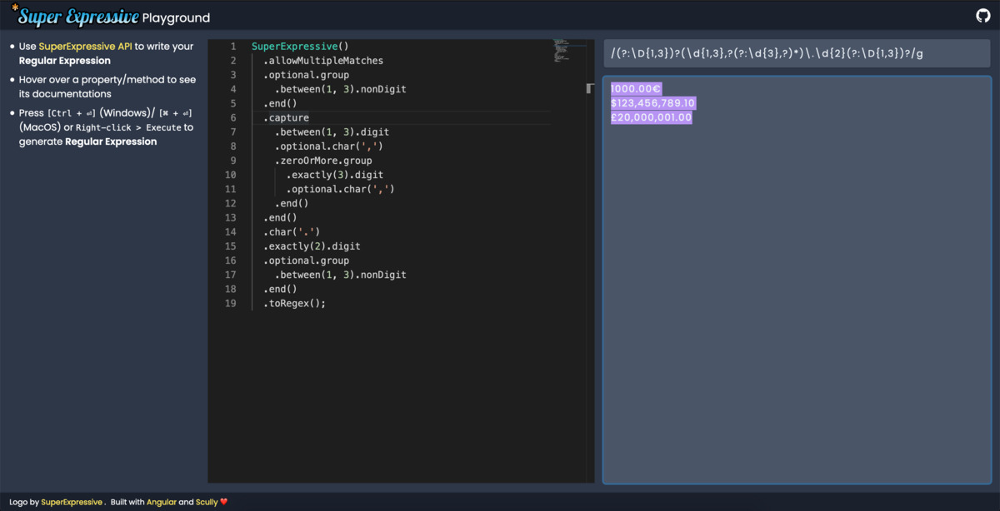

# Super Expressive


**Super Expressive** is a JavaScript library that allows you to build regular expressions in almost natural language - with no extra dependencies, and a lightweight code footprint (less than 4kb with minification + gzip!).

---

- [Why](#Why)
- [Installation and Usage](#Installation-and-Usage)
- [Example](#Example)
- [Playground](#Playground)
- [Ports](#Ports)
- [API](#API)
  <details>
    <summary>Click to expand</summary>

  - [SuperExpressive()](#SuperExpressive)
  - [.allowMultipleMatches](#allowMultipleMatches)
  - [.lineByLine](#lineByLine)
  - [.caseInsensitive](#caseInsensitive)
  - [.sticky](#sticky)
  - [.unicode](#unicode)
  - [.singleLine](#singleLine)
  - [.anyChar](#anyChar)
  - [.whitespaceChar](#whitespaceChar)
  - [.nonWhitespaceChar](#nonWhitespaceChar)
  - [.digit](#digit)
  - [.nonDigit](#nonDigit)
  - [.word](#word)
  - [.nonWord](#nonWord)
  - [.wordBoundary](#wordBoundary)
  - [.nonWordBoundary](#nonWordBoundary)
  - [.newline](#newline)
  - [.carriageReturn](#carriageReturn)
  - [.tab](#tab)
  - [.nullByte](#nullByte)
  - [.anyOf](#anyOf)
  - [.capture](#capture)
  - [.namedCapture(name)](#namedCapturename)
  - [.backreference(index)](#backreferenceindex)
  - [.namedBackreference(index)](#namedBackreferenceindex)
  - [.group](#group)
  - [.end()](#end())
  - [.assertAhead](#assertAhead)
  - [.assertNotAhead](#assertNotAhead)
  - [.assertBehind](#assertBehind)
  - [.assertNotBehind](#assertNotBehind)
  - [.optional](#optional)
  - [.zeroOrMore](#zeroOrMore)
  - [.zeroOrMoreLazy](#zeroOrMoreLazy)
  - [.oneOrMore](#oneOrMore)
  - [.oneOrMoreLazy](#oneOrMoreLazy)
  - [.exactly(n)](#exactlyn)
  - [.atLeast(n)](#atLeastn)
  - [.between(x, y)](#betweenx-y)
  - [.betweenLazy(x, y)](#betweenLazyx-y)
  - [.startOfInput](#startOfInput)
  - [.endOfInput](#endOfInput)
  - [.anyOfChars(chars)](#anyOfCharschars)
  - [.anythingButChars(chars)](#anythingButCharschars)
  - [.anythingButString(str)](#anythingButStringstr)
  - [.anythingButRange(a, b)](#anythingButRangea-b)
  - [.string(s)](#strings)
  - [.char(c)](#charc)
  - [.range(a, b)](#rangea-b)
  - [.subexpression(expr, opts)](#subexpressionexpr-opts)
  - [.toRegexString()](#toRegexString)
  - [.toRegex()](#toRegex)
  </details>

## Why?

Regex is a very powerful tool, but its terse and cryptic vocabulary can make constructing and communicating them with others a challenge. Even developers who understand them well can have trouble reading their own back just a few months later! In addition, they can't be easily created and manipulated in a programmatic way - closing off an entire avenue of dynamic text processing.

That's where **Super Expressive** comes in. It provides a programmatic and human readable way to create regular expressions. It's API uses the [fluent builder pattern](https://en.wikipedia.org/wiki/Fluent_interface), and is completely immutable. It's built to be discoverable and predictable:

- properties and methods describe what they do in plain English
- order matters! quantifiers are specified before the thing they change, just like in English (e.g. `SuperExpressive().exactly(5).digit`)
- if you make a mistake, you'll know how to fix it. SuperExpressive will guide you towards a fix if your expression is invalid
- [subexpressions](#subexpressionexpr-opts) can be used to create meaningful, reusable components
- includes an `index.d.ts` file for full TypeScript support

SuperExpressive turns those complex and unwieldy regexes that appear in code reviews into something that can be read, understood, and **properly reviewed** by your peers - and maintained by anyone!

## Installation and Usage

```
npm i super-expressive
```

```JavaScript
const SuperExpressive = require('super-expressive');

// Or as an ES6 module
import SuperExpressive from 'super-expressive';
```

## Example

The following example recognises and captures the value of a 16-bit hexadecimal number like `0xC0D3`.

```javascript
const SuperExpressive = require('super-expressive');

const myRegex = SuperExpressive()
  .startOfInput
  .optional.string('0x')
  .capture
    .exactly(4).anyOf
      .range('A', 'F')
      .range('a', 'f')
      .range('0', '9')
    .end()
  .end()
  .endOfInput
  .toRegex();

// Produces the following regular expression:
/^(?:0x)?([A-Fa-f0-9]{4})$/
```

## Playground

You can experiment with `SuperExpressive` in the [Super Expressive Playground](https://sepg.netlify.app/) by [@nartc](https://github.com/nartc). This is a great way to build a regex description, and test it against various inputs.



## Ports

Super Expressive has been ported to the following languages:

### PHP

https://github.com/bassim/super-expressive-php by <a href="https://github.com/bassim/">@bassim</a>

### Ruby

https://github.com/hiy/super-expressive-ruby by <a href="https://github.com/hiy">@hiy</a>

### Python

https://github.com/stanislav-tsaplev/super_expressive by <a href="https://github.com/stanislav-tsaplev">@stanislav-tsaplev</a>

## API

### SuperExpressive()

`SuperExpressive()`

Creates an instance of `SuperExpressive`.

### .allowMultipleMatches

Uses the `g` flag on the regular expression, which indicates that it should match multiple values when run on a string.

**Example**
```JavaScript
SuperExpressive()
  .allowMultipleMatches
  .string('hello')
  .toRegex();
// ->
/hello/g
```

### .lineByLine

Uses the `m` flag on the regular expression, which indicates that it should treat the [.startOfInput](#startOfInput) and [.endOfInput](#endOfInput) markers as the start and end of lines.

**Example**
```JavaScript
SuperExpressive()
  .lineByLine
  .string('^hello$')
  .toRegex();
// ->
/\^hello\$/m
```

### .caseInsensitive

Uses the `i` flag on the regular expression, which indicates that it should treat ignore the uppercase/lowercase distinction when matching.

**Example**
```JavaScript
SuperExpressive()
  .caseInsensitive
  .string('HELLO')
  .toRegex();
// ->
/HELLO/i
```

### .sticky

Uses the `y` flag on the regular expression, which indicates that it should create a stateful regular expression that can be resumed from the last match.

**Example**
```JavaScript
SuperExpressive()
  .sticky
  .string('hello')
  .toRegex();
// ->
/hello/y
```

### .unicode

Uses the `u` flag on the regular expression, which indicates that it should use full unicode matching.

**Example**
```JavaScript
SuperExpressive()
  .unicode
  .string('héllo')
  .toRegex();
// ->
/héllo/u
```

### .singleLine

Uses the `s` flag on the regular expression, which indicates that the input should be treated as a single line, where the [.startOfInput](#startOfInput) and [.endOfInput](#endOfInput) markers explicitly mark the start and end of input, and [.anyChar](#anyChar) also matches newlines.

**Example**
```JavaScript
SuperExpressive()
  .singleLine
  .string('hello')
  .anyChar
  .string('world')
  .toRegex();
// ->
/hello.world/s
```

### .anyChar

Matches any single character. When combined with [.singleLine](#singleLine), it also matches newlines.

**Example**
```JavaScript
SuperExpressive()
  .anyChar
  .toRegex();
// ->
/./
```

### .whitespaceChar

Matches any whitespace character, including the special whitespace characters: `\r\n\t\f\v`.

**Example**
```JavaScript
SuperExpressive()
  .whitespaceChar
  .toRegex();
// ->
/\s/
```

### .nonWhitespaceChar

Matches any non-whitespace character, excluding also the special whitespace characters: `\r\n\t\f\v`.

**Example**
```JavaScript
SuperExpressive()
  .nonWhitespaceChar
  .toRegex();
// ->
/\S/
```

### .digit

Matches any digit from `0-9`.

**Example**
```JavaScript
SuperExpressive()
  .digit
  .toRegex();
// ->
/\d/
```

### .nonDigit

Matches any non-digit.

**Example**
```JavaScript
SuperExpressive()
  .nonDigit
  .toRegex();
// ->
/\D/
```

### .word

Matches any alpha-numeric (`a-z, A-Z, 0-9`) characters, as well as `_`.

**Example**
```JavaScript
SuperExpressive()
  .word
  .toRegex();
// ->
/\w/
```
### .nonWord

Matches any non alpha-numeric (`a-z, A-Z, 0-9`) characters, excluding `_` as well.

**Example**
```JavaScript
SuperExpressive()
  .nonWord
  .toRegex();
// ->
/\W/
```

### .wordBoundary

Matches (without consuming any characters) immediately between a character matched by [.word](#word) and a character not matched by [.word](#word) (in either order).

**Example**
```JavaScript
SuperExpressive()
  .digit
  .wordBoundary
  .toRegex();
// ->
/\d\b/
```

### .nonWordBoundary

Matches (without consuming any characters) at the position between two characters matched by [.word](#word).

**Example**
```JavaScript
SuperExpressive()
  .digit
  .nonWordBoundary
  .toRegex();
// ->
/\d\B/
```

### .newline

Matches a `\n` character.

**Example**
```JavaScript
SuperExpressive()
  .newline
  .toRegex();
// ->
/\n/
```

### .carriageReturn

Matches a `\r` character.

**Example**
```JavaScript
SuperExpressive()
  .carriageReturn
  .toRegex();
// ->
/\r/
```

### .tab

Matches a `\t` character.

**Example**
```JavaScript
SuperExpressive()
  .tab
  .toRegex();
// ->
/\t/
```

### .nullByte

Matches a `\u0000` character (ASCII `0`).

**Example**
```JavaScript
SuperExpressive()
  .nullByte
  .toRegex();
// ->
/\0/
```

### .anyOf

Matches a choice between specified elements. Needs to be finalised with `.end()`.

**Example**
```JavaScript
SuperExpressive()
  .anyOf
    .range('a', 'f')
    .range('0', '9')
    .string('XXX')
  .end()
  .toRegex();
// ->
/(?:XXX|[a-f0-9])/
```

### .capture

Creates a capture group for the proceeding elements. Needs to be finalised with `.end()`. Can be later referenced with [backreference(index)](#backreferenceindex).

**Example**
```JavaScript
SuperExpressive()
  .capture
    .range('a', 'f')
    .range('0', '9')
    .string('XXX')
  .end()
  .toRegex();
// ->
/([a-f][0-9]XXX)/
```

### .namedCapture(name)

Creates a named capture group for the proceeding elements. Needs to be finalised with `.end()`. Can be later referenced with [namedBackreference(name)](#namedBackreferencename) or [backreference(index)](#backreferenceindex).

**Example**
```JavaScript
SuperExpressive()
  .namedCapture('interestingStuff')
    .range('a', 'f')
    .range('0', '9')
    .string('XXX')
  .end()
  .toRegex();
// ->
/(?<interestingStuff>[a-f][0-9]XXX)/
```

### .namedBackreference(name)

Matches exactly what was previously matched by a [namedCapture](#namedCapturename).

**Example**
```JavaScript
SuperExpressive()
  .namedCapture('interestingStuff')
    .range('a', 'f')
    .range('0', '9')
    .string('XXX')
  .end()
  .string('something else')
  .namedBackreference('interestingStuff')
  .toRegex();
// ->
/(?<interestingStuff>[a-f][0-9]XXX)something else\k<interestingStuff>/
```

### .backreference(index)

Matches exactly what was previously matched by a [capture](#capture) or [namedCapture](#namedCapturename) using a positional index. Note regex indexes start at 1, so the first capture group has index 1.

**Example**
```JavaScript
SuperExpressive()
  .capture
    .range('a', 'f')
    .range('0', '9')
    .string('XXX')
  .end()
  .string('something else')
  .backreference(1)
  .toRegex();
// ->
/([a-f][0-9]XXX)something else\1/
```

### .group

Creates a non-capturing group of the proceeding elements. Needs to be finalised with `.end()`.

**Example**
```JavaScript
SuperExpressive()
  .optional.group
    .range('a', 'f')
    .range('0', '9')
    .string('XXX')
  .end()
  .toRegex();
// ->
/(?:[a-f][0-9]XXX)?/
```

### .end()

Signifies the end of a SuperExpressive grouping, such as [.anyOf](#anyOf), [.group](#group), or [.capture](#capture).

**Example**
```JavaScript
SuperExpressive()
  .capture
    .anyOf
      .range('a', 'f')
      .range('0', '9')
      .string('XXX')
    .end()
  .end()
  .toRegex();
// ->
/((?:XXX|[a-f0-9]))/
```

### .assertAhead

Assert that the proceeding elements are found without consuming them. Needs to be finalised with `.end()`.

**Example**
```JavaScript
SuperExpressive()
  .assertAhead
    .range('a', 'f')
  .end()
  .range('a', 'z')
  .toRegex();
// ->
/(?=[a-f])[a-z]/
```

### .assertNotAhead

Assert that the proceeding elements are **not** found without consuming them. Needs to be finalised with `.end()`.

**Example**
```JavaScript
SuperExpressive()
  .assertNotAhead
    .range('a', 'f')
  .end()
  .range('g', 'z')
  .toRegex();
// ->
/(?![a-f])[g-z]/
```

### .assertBehind

Assert that the elements contained within **are** found immediately before this point in the string. Needs to be finalised with `.end()`.

**Example**
```JavaScript
SuperExpressive()
  .assertBehind
    .string('hello ')
  .end()
  .string('world')
  .toRegex();
// ->
/(?<=hello )world/
```

### .assertNotBehind

Assert that the elements contained within are **not** found immediately before this point in the string. Needs to be finalised with `.end()`.

**Example**
```JavaScript
SuperExpressive()
  .assertNotBehind
    .string('hello ')
  .end()
  .string('world')
  .toRegex();
// ->
/(?<!hello )world/
```

### .optional

Assert that the proceeding element may or may not be matched.

**Example**
```JavaScript
SuperExpressive()
  .optional.digit
  .toRegex();
// ->
/\d?/
```

### .zeroOrMore

Assert that the proceeding element may not be matched, or may be matched multiple times.

**Example**
```JavaScript
SuperExpressive()
  .zeroOrMore.digit
  .toRegex();
// ->
/\d*/
```

### .zeroOrMoreLazy

Assert that the proceeding element may not be matched, or may be matched multiple times, but as few times as possible.

**Example**
```JavaScript
SuperExpressive()
  .zeroOrMoreLazy.digit
  .toRegex();
// ->
/\d*?/
```

### .oneOrMore

Assert that the proceeding element may be matched once, or may be matched multiple times.

**Example**
```JavaScript
SuperExpressive()
  .oneOrMore.digit
  .toRegex();
// ->
/\d+/
```

### .oneOrMoreLazy

Assert that the proceeding element may be matched once, or may be matched multiple times, but as few times as possible.

**Example**
```JavaScript
SuperExpressive()
  .oneOrMoreLazy.digit
  .toRegex();
// ->
/\d+?/
```

### .exactly(n)

Assert that the proceeding element will be matched exactly `n` times.

**Example**
```JavaScript
SuperExpressive()
  .exactly(5).digit
  .toRegex();
// ->
/\d{5}/
```

### .atLeast(n)

Assert that the proceeding element will be matched at least `n` times.

**Example**
```JavaScript
SuperExpressive()
  .atLeast(5).digit
  .toRegex();
// ->
/\d{5,}/
```

### .between(x, y)

Assert that the proceeding element will be matched somewhere between `x` and `y` times.

**Example**
```JavaScript
SuperExpressive()
  .between(3, 5).digit
  .toRegex();
// ->
/\d{3,5}/
```

### .betweenLazy(x, y)

Assert that the proceeding element will be matched somewhere between `x` and `y` times, but as few times as possible.

**Example**
```JavaScript
SuperExpressive()
  .betweenLazy(3, 5).digit
  .toRegex();
// ->
/\d{3,5}?/
```

### .startOfInput

Assert the start of input, or the start of a line when [.lineByLine](#lineByLine) is used.

**Example**
```JavaScript
SuperExpressive()
  .startOfInput
  .string('hello')
  .toRegex();
// ->
/^hello/
```

### .endOfInput

Assert the end of input, or the end of a line when [.lineByLine](#lineByLine) is used.

**Example**
```JavaScript
SuperExpressive()
  .string('hello')
  .endOfInput
  .toRegex();
// ->
/hello$/
```

### .anyOfChars(chars)

Matches any of the characters in the provided string `chars`.

**Example**
```JavaScript
SuperExpressive()
  .anyOfChars('aeiou')
  .toRegex();
// ->
/[aeiou]/
```

### .anythingButChars(chars)

Matches any character, except any of those in the provided string `chars`.

**Example**
```JavaScript
SuperExpressive()
  .anythingButChars('aeiou')
  .toRegex();
// ->
/[^aeiou]/
```

### .anythingButString(str)

Matches any string the same length as `str`, except the characters sequentially defined in `str`.

**Example**
```JavaScript
SuperExpressive()
  .anythingButString('aeiou')
  .toRegex();
// ->
/(?:[^a][^e][^i][^o][^u])/
```

### .anythingButRange(a, b)

Matches any character, except those that would be captured by the [.range](#rangea-b) specified by `a` and `b`.

**Example**
```JavaScript
SuperExpressive()
  .anythingButRange(0, 9)
  .toRegex();
// ->
/[^0-9]/
```

### .string(s)

Matches the exact string `s`.

**Example**
```JavaScript
SuperExpressive()
  .string('hello')
  .toRegex();
// ->
/hello/
```

### .char(c)

Matches the exact character `c`.

**Example**
```JavaScript
SuperExpressive()
  .char('x')
  .toRegex();
// ->
/x/
```

### .range(a, b)

Matches any character that falls between `a` and `b`. Ordering is defined by a characters ASCII or unicode value.

**Example**
```JavaScript
SuperExpressive()
  .range('a', 'z')
  .toRegex();
// ->
/[a-z]/
```

### .subexpression(expr, opts?)

- *opts.namespace*: A **string** namespace to use on all named capture groups in the subexpression, to avoid naming collisions with your own named groups (default = `''`)
- *opts.ignoreFlags*: If set to true, any flags this subexpression specifies should be disregarded (default = `true`)
- *opts.ignoreStartAndEnd*: If set to true, any startOfInput/endOfInput asserted in this subexpression specifies should be disregarded (default = `true`)

Matches another SuperExpressive instance inline. Can be used to create libraries, or to modularise you code. By default, flags and start/end of input markers are ignored, but can be explcitly turned on in the options object.

**Example**
```JavaScript
// A reusable SuperExpressive...
const fiveDigits = SuperExpressive().exactly(5).digit;

SuperExpressive()
  .oneOrMore.range('a', 'z')
  .atLeast(3).anyChar
  .subexpression(fiveDigits)
  .toRegex();
// ->
/[a-z]+.{3,}\d{5}/
```


### .toRegexString()

Outputs a string representation of the regular expression that this SuperExpression models.

**Example**
```JavaScript
SuperExpressive()
  .allowMultipleMatches
  .lineByLine
  .startOfInput
  .optional.string('0x')
  .capture
    .exactly(4).anyOf
      .range('A', 'F')
      .range('a', 'f')
      .range('0', '9')
    .end()
  .end()
  .endOfInput
  .toRegexString();
// ->
"/^(?:0x)?([A-Fa-f0-9]{4})$/gm"
```

### .toRegex()

Outputs the regular expression that this SuperExpression models.

**Example**
```JavaScript
SuperExpressive()
  .allowMultipleMatches
  .lineByLine
  .startOfInput
  .optional.string('0x')
  .capture
    .exactly(4).anyOf
      .range('A', 'F')
      .range('a', 'f')
      .range('0', '9')
    .end()
  .end()
  .endOfInput
  .toRegex();
// ->
/^(?:0x)?([A-Fa-f0-9]{4})$/gm
```

